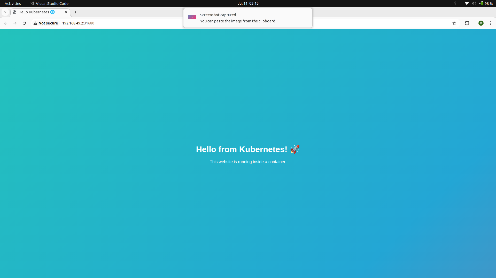

# 🚀 Visual Web Project – Kubernetes Animated Website

This project demonstrates a visually appealing **animated website** deployed using **Docker** and **Kubernetes (Minikube)**.

It features a simple static site with animated CSS and JavaScript, containerized using **Nginx**, and deployed via a **Kubernetes Deployment, Namespace, and Service**.

---

## 🌐 Live Demo (Minikube)

You can access the site locally via:  
`http://localhost:<NodePort>` after deploying using Minikube.

---

## 🧱 Tech Stack

- 🧾 HTML, CSS (Animated)
- 🔌 JavaScript
- 🐳 Docker (Nginx)
- ☸️ Kubernetes (Minikube)
- 💻 YAML for deployment

---

## 📁 Folder Structure

```
visual-web-project/
├── index.html           # Main animated page
├── style.css            # CSS gradient animation
├── script.js            # JS console log
├── Dockerfile           # Containerizes site with Nginx
├── namespace.yaml       # Creates hello-kubernetes namespace
├── deployment.yaml      # Deploys container in Kubernetes
└── service.yaml         # Exposes app via NodePort on port 8080
```

---

## 🚀 How to Run It

### 1️⃣ Clone the Repo

```bash
git clone https://github.com/Dasmat13/visual-web-project.git
cd visual-web-project
```

---

### 2️⃣ Build and Push Docker Image

```bash
docker build -t dasmat13/kube-animated-site .
docker push dasmat13/kube-animated-site
```

---

### 3️⃣ Start Minikube and Apply Manifests

```bash
minikube start
kubectl apply -f namespace.yaml
kubectl apply -f deployment.yaml
kubectl apply -f service.yaml
```

---

### 4️⃣ Access the Website

Open in browser via:

```bash
minikube service hello-service -n hello-kubernetes
```

Or manually:

```bash
kubectl get svc -n hello-kubernetes
```

Then visit:

```
http://localhost:<NodePort>
```

---

## 📸 Screenshot or Preview

Here’s what the website looks like:


---

## 📜 License

MIT License

---

## 🙋‍♂️ Author

- GitHub: [@Dasmat13](https://github.com/Dasmat13)